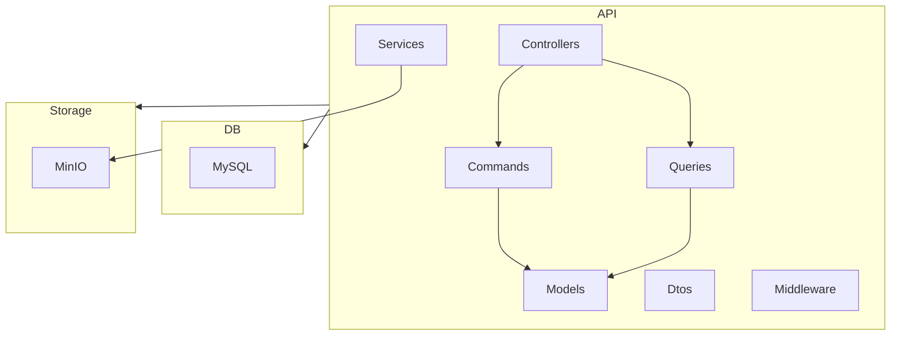

# Arquitetura do Projeto CRM API

> Última atualização: 2025-12-03
> Versão do documento: 1.0

## Índice
- [Diagrama de componentes](#diagrama-de-componentes)
- [Padrões arquiteturais](#padrões-arquiteturais)
- [Fluxo de dados end-to-end](#fluxo-de-dados-end-to-end)
- [Modelos de deploy](#modelos-de-deploy)
- [Performance e escalabilidade](#performance-e-escalabilidade)
- [Referências](#referências)
- [TODOs / Perguntas](#todos--perguntas)

## Diagrama de componentes

## Padrões arquiteturais
- **MVC + CQRS:** Separação clara entre comandos (escrita) e queries (leitura).
- **DDD:** Uso de entidades e modelos de domínio.
- **Dependency Injection:** Serviços e handlers injetados via DI.
- **Middleware:** Filtros para resposta padronizada.
- **Containerização:** Docker para ambiente isolado.

## Fluxo de dados end-to-end
1. **Request** → Controller
2. **Autenticação** (JWT, [Authorize])
3. **Validação** (DTOs, atributos)
4. **Command/Query** → Handler
5. **Serviço** (ex.: Storage, Usuário)
6. **Banco de dados** (EF Core, MySQL)
7. **Resposta** → Middleware → API

## Modelos de deploy
- **Containers:** Dockerfile e docker-compose para API, MySQL e MinIO.
- **Volumes:** Persistência de dados para MinIO e MySQL.
- **Rede interna:** `crm-network` para comunicação entre serviços.
- **Swagger:** Documentação automática em dev.

Arquivos relevantes:
- [Dockerfile](../Dockerfile)
- [docker-compose.yml](../docker-compose.yml)
- [appsettings.json](../appsettings.json)

## Performance e escalabilidade
- **CQRS:** Facilita escalabilidade horizontal.
- **MySQL:** Suporte a grandes volumes de dados.
- **MinIO:** Armazenamento escalável de arquivos.
- **Configuração de CORS:** Permite integração com frontend externo.
- **TODO:** Confirmar uso de cache, filas ou balanceamento de carga.

## Referências
- [Program.cs](../Program.cs)
- [Crm.csproj](../Crm.csproj)
- [Controllers](../Controllers/)
- [Services](../Services/)

## TODOs / Perguntas
- Confirmar uso de cache ou filas
- Detalhar políticas de backup e disaster recovery
- Validar limites de escalabilidade do MinIO
