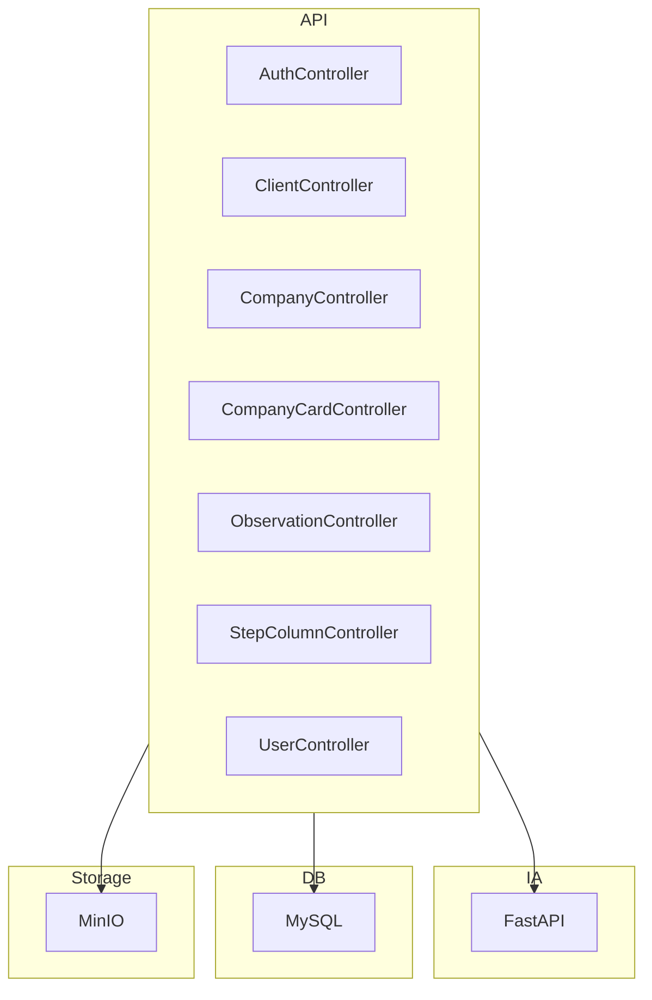

# Projeto CRM API

> Última atualização: 2025-12-03
> Versão do documento: 1.0

## Índice
- [Propósito](#propósito)
- [Público alvo](#público-alvo)
- [Stack principal](#stack-principal)
- [Diagrama de alto nível](#diagrama-de-alto-nível)
- [Principais módulos](#principais-módulos)
- [Contato e informações](#contato-e-informações)
- [Referências](#referências)
- [TODOs / Perguntas](#todos--perguntas)

## Propósito
Sistema de CRM (Customer Relationship Management) para gestão de clientes, empresas, cards e observações.

## Público alvo
Empresas e equipes que precisam organizar e acompanhar o relacionamento com clientes e oportunidades.

## Stack principal
- **Backend:** C# (.NET 8)
- **IA/API de Machine Learning:** Python (FastAPI)
- **ORM:** Entity Framework Core 9
- **Banco de dados:** MySQL 8
- **Armazenamento de arquivos:** MinIO (Cloudflare R2 compatível)
- **Autenticação:** JWT
- **API:** RESTful
- **Containerização:** Docker
- **Orquestração:** Docker Compose
- **Documentação:** Swagger, FastAPI Docs

## Diagrama de alto nível

- **Controllers/**: Endpoints REST
- **Commands/**: Lógica de comandos (CQRS)
- **Queries/**: Consultas (CQRS)
- **Models/**: Entidades do domínio
- **Dtos/**: Data Transfer Objects
- **ai/**: API de IA (FastAPI) para predição de probabilidade
## Novas funcionalidades

- **Integração com API de IA:**
    - O sistema agora integra uma API de Machine Learning (FastAPI) para predição de probabilidade de sucesso de oportunidades.
    - Comunicação interna via Docker Compose, sem expor a IA externamente.
    - Endpoint principal: `POST /predict` (ver documentação em `ai/README.md`).

- **Novos campos para oportunidades:**
    - `sector` (Setor do cliente)
    - `prioridade` (Prioridade da oportunidade)
    - Ambos são necessários para a predição, mas ainda não existem no back-end principal.

Consulte também a documentação detalhada da IA em `ai/README.md`.
- **Services/**: Serviços internos (ex.: storage, usuário)
- **Migrations/**: Migrações do banco
- **Configurations/**: Configuração de modelos
- **Middleware/**: Filtros e wrappers de resposta

## Contato e informações
- Maintainers: TODO: Adicionar nomes/emails dos responsáveis
- Mais informações: [README.md](../../README.md), [README_PROJETO.md](../../README_PROJETO.md)

## Referências
- [Controllers](../Controllers/)
- [Models](../Models/)
- [Commands](../Commands/)
- [Queries](../Queries/)
- [Dtos](../Dtos/)
- [Services](../Services/)
- [Migrations](../Migrations/)
- [Configurations](../Configurations/)
- [Middleware](../Middleware/)

## TODOs / Perguntas
- Confirmar contato dos maintainers
- Detalhar integrações externas além de MinIO/MySQL
- Validar se há frontend/UI acoplado
- Confirmar políticas de backup e escalabilidade
